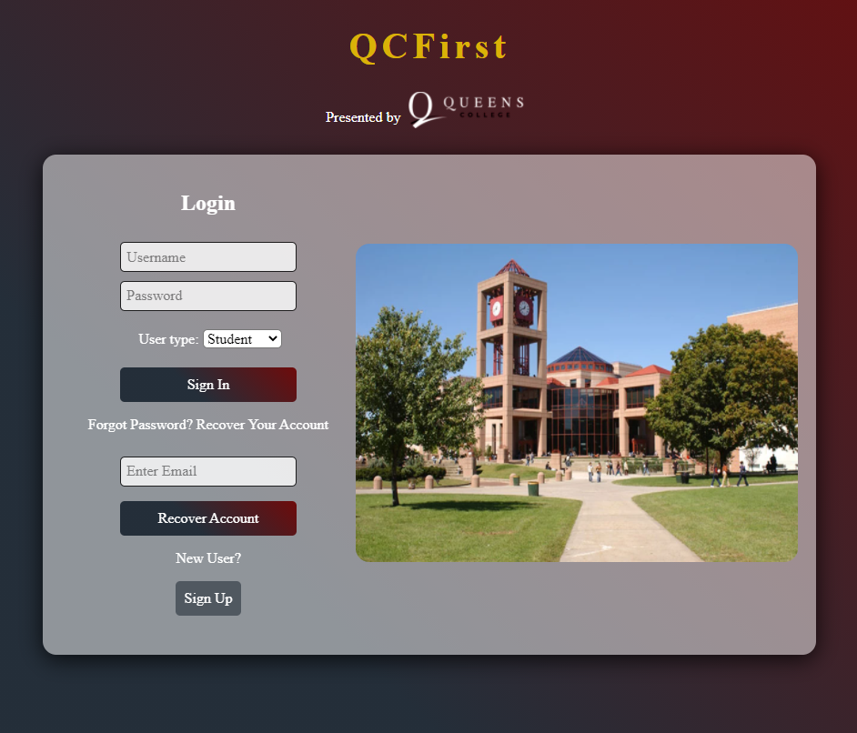
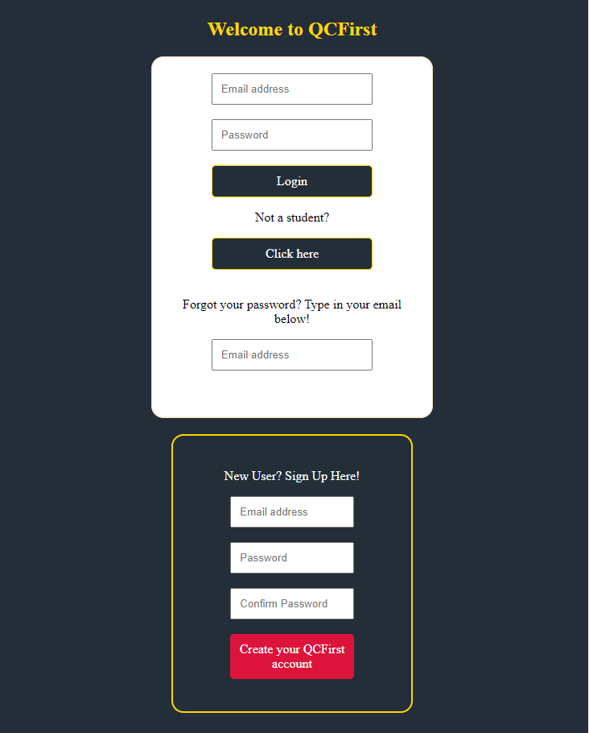

# QCFirst
## Students most important tool for everything involving QC Academics
### Sign Up Page
SignUp and LogIn page for the students will have slideshow of the campus and students.
The professors sign up and log in page will have slideshow of professors in campus eventually.
Creating an account will redirect to login page, using the credentials you signed up with.

### Dashboard
Students will be able to view their courses, financial details, personal info and important messages.
Messages will cover holds, to-do list, important files, school updates.
I want to open up a modal with JS to avoid heading to different links or QCFirst features.
Ex. clicking a link would open a popup to do what ever the link disguised as a button should perform.

### Courses
This is only the HTML portion. With some CSS it should be a dropdown menu that keeps updating with every option selected.
Ex. There are more than 10 departments. Choosing a department, would change the options in the next dropdown menu.
We choose Math, and only math courses will show up in the next dropdown menu, or all professors in the math department.
In the future when we get to databases, this will make the selection of courses easier

