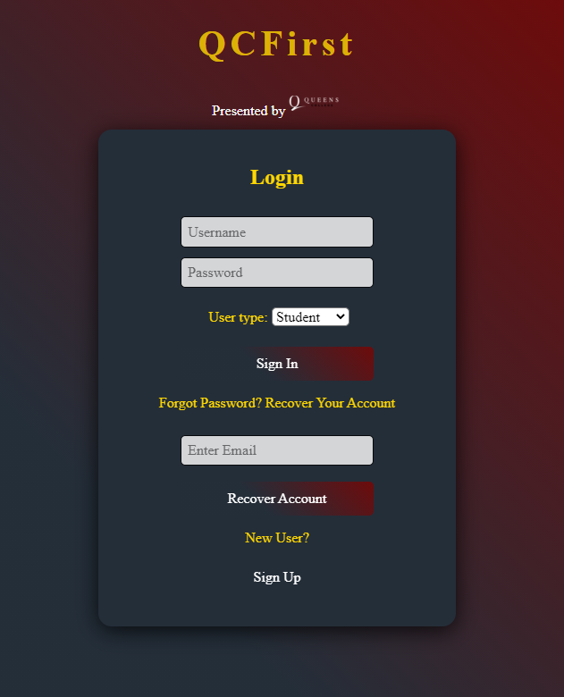
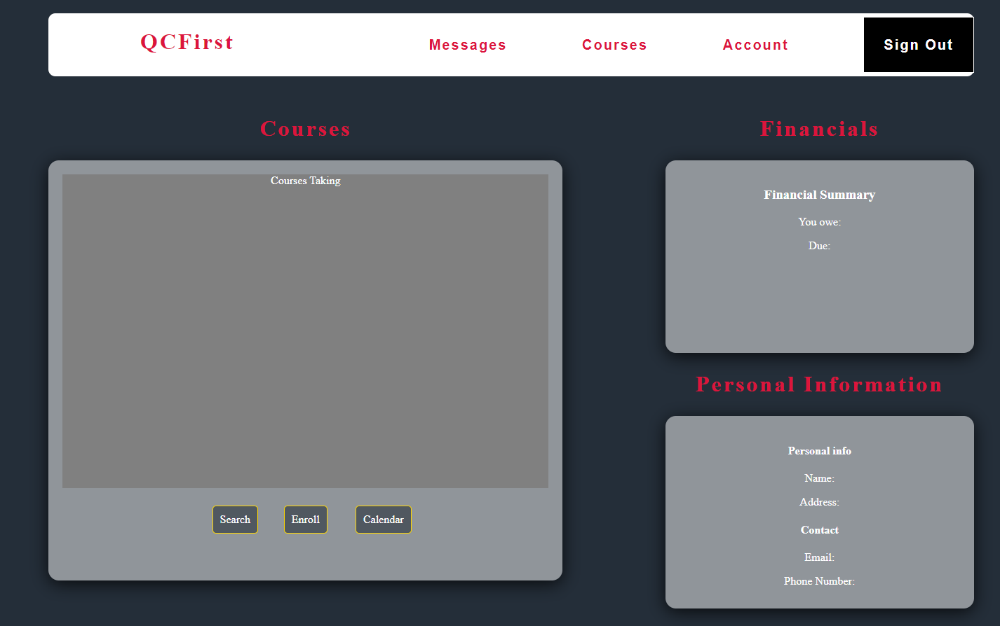
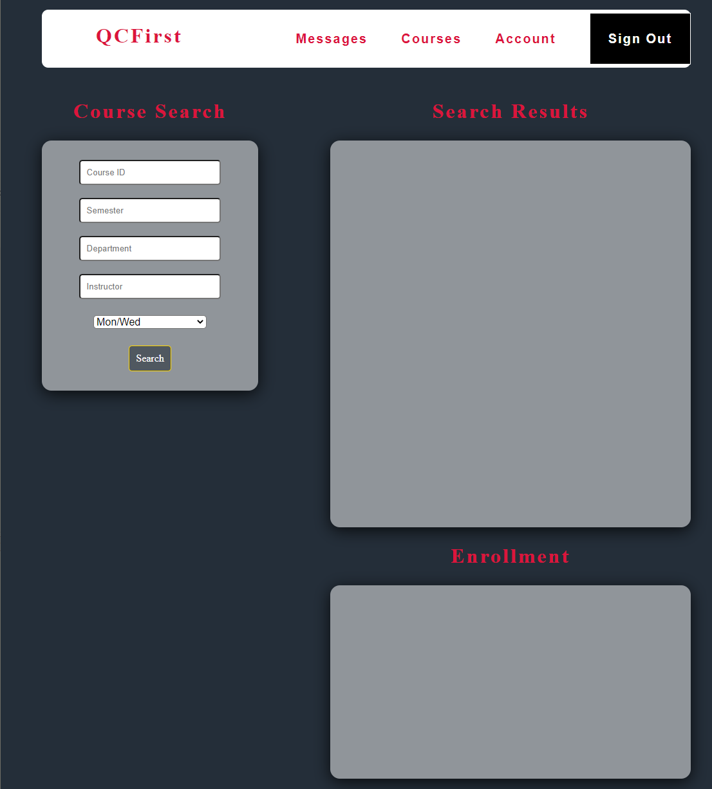

# QCFirst
## Students most important tool for everything involving QC Academics
### Sign Up Page
Signup and Login page for the students and professors will have slideshow of the campus and students.
Making a selection will redirect you to the user type login.
Select teacher, and you will be directed to the instructor version of QCFirst
Creating an account will redirect to login page, using the credentials you signed up with.

### Dashboard
Students will be able to view their courses, financial details, personal info and important messages.
Right now, a payment set up is fodder, therefore it was removed for the time being.
Messages will cover holds, to-do list, important files, school updates.

### Courses
Students will be able to search for their classes using a unique class id, enroll in their class. With the use of databases and scripts used will display real-time enrollment and class searches on the same page.

